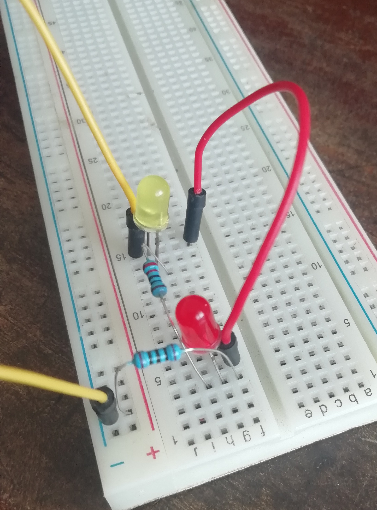
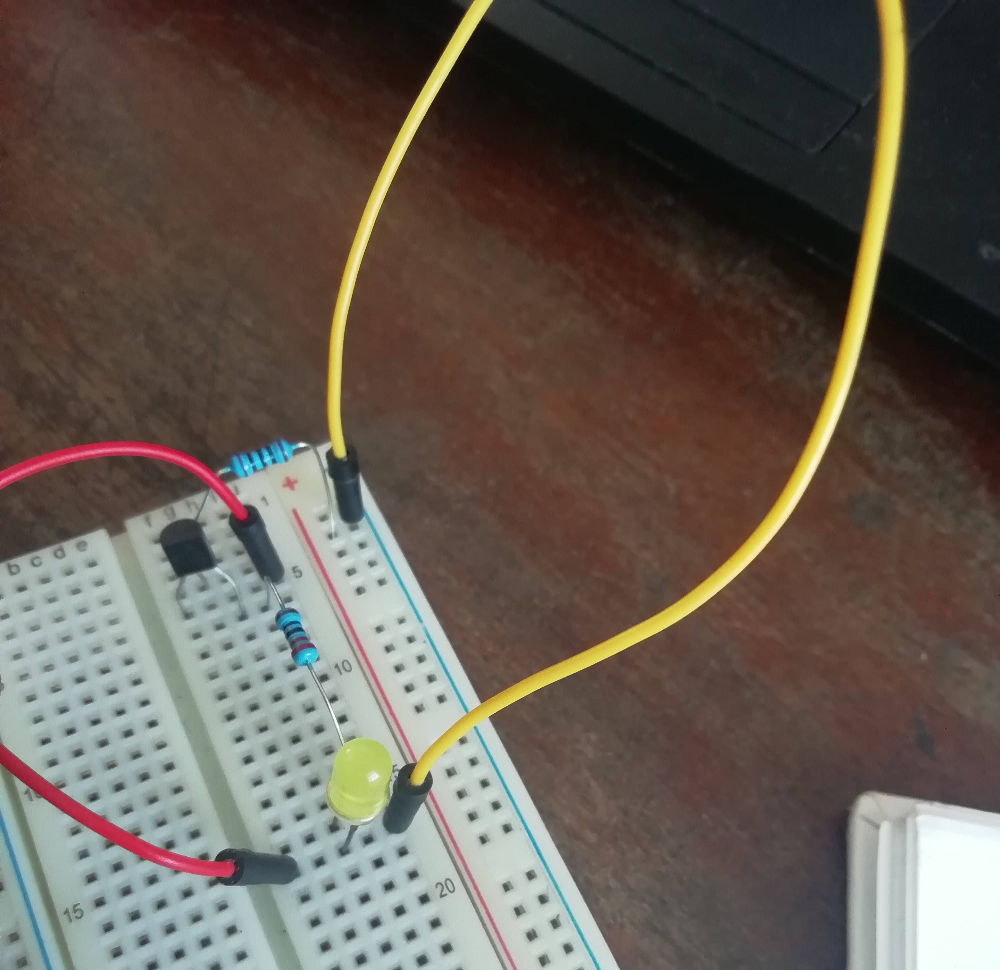
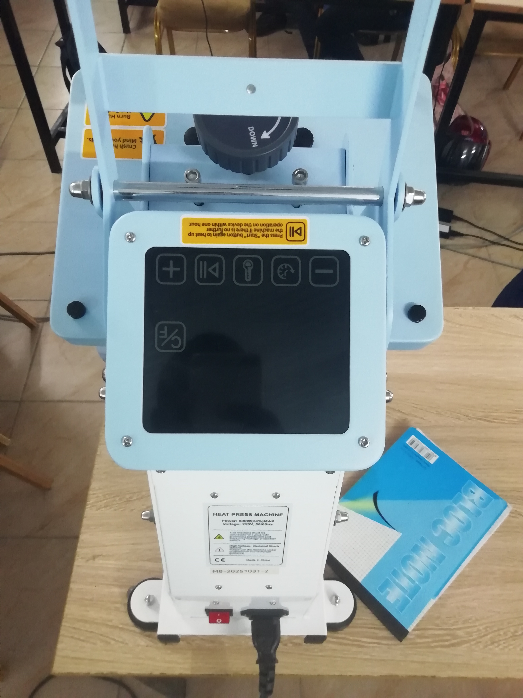

## Journal-Mardi 01 septembre 2026 (rédigé par Marc HODIA) 

## Fait aujourd'hui

- Nos avons fait trois atéliers:
- Atélier d'électricité 
-  la maitrise de la breadboart SK10
- la fabrication de trois circuits elctriques avec les éléments suivant : la plaquette breadboard; deux LED : deux resistors ; les fils de connection ; le transistor 2A2222 ;
- Atélier de l'impression DTF avec Xtool
- la conception d'une image et reglage sur l'imprimante avant le lancement de l'impression . 
- [] Atélier de la modélisation avec la fusion 360 
- La modélisation de deux objets .

## Appris

J'ai maitrisé le branchement sur breadboard pour faire les circuits électrique simple

- circuit avec transistor

- La maitrise de  xtool pour concevoir l'image à imprimer sur l'appareil printer

- la modelisation de la porte clé avec la fusion 360

## raté puis corrigé
- la fixation de l'image sur l'appareil  craft express ou avec le fer à repasser

## Décidé
- charger les tutoriels sur youtube
## A faire demain
- Modélisation ; electricité et impression

