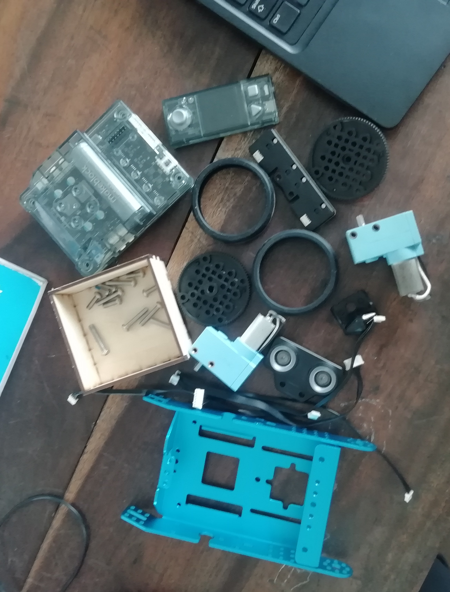
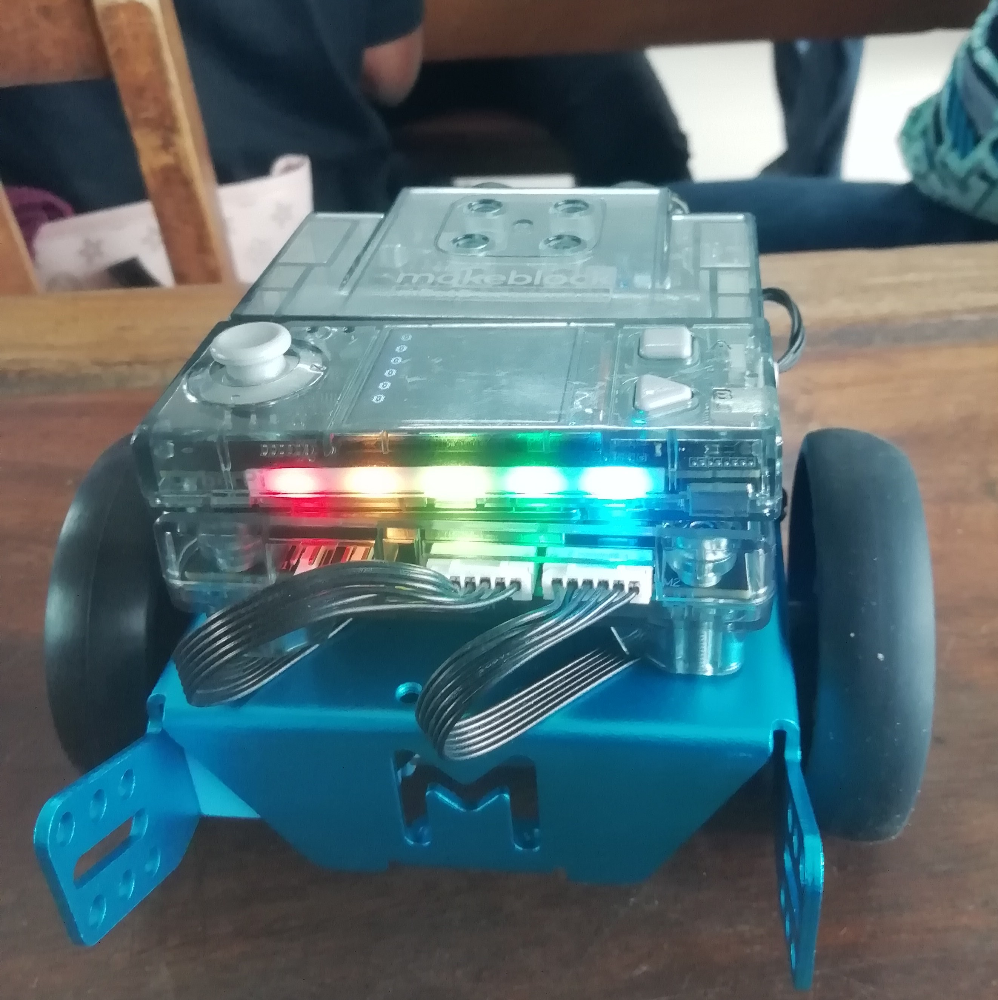
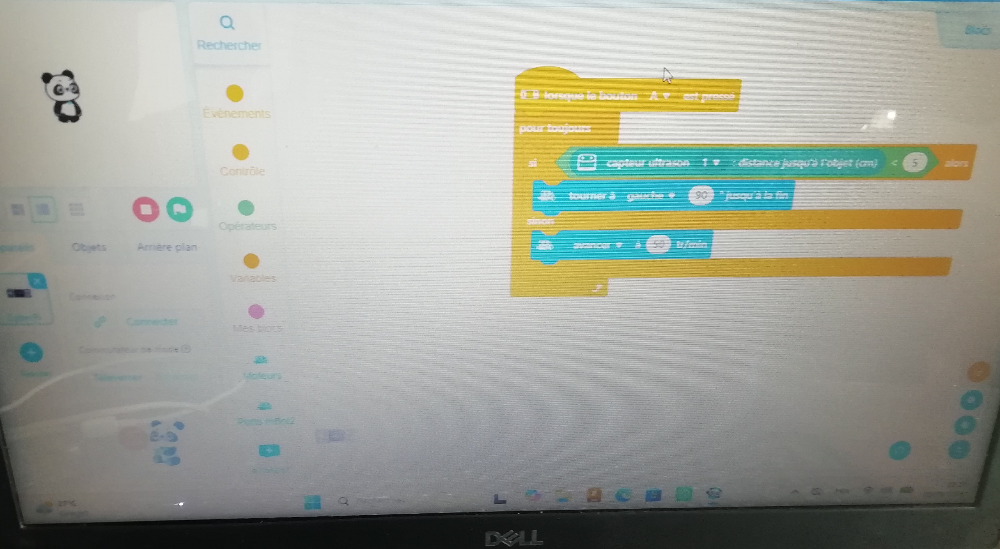
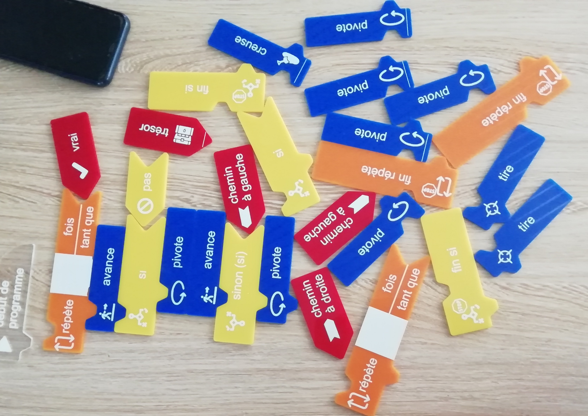

## Journal-mercredi 02 septembre 2026(rédigé par Marc HODIA)

## fait aujourd'hui

- Atélier d'électricité 

- Montage d'un robot intélligent puis programation de la cyberpi pour faire avancer le robot puis changer la direction à gauche si voir un obstacle à moins 5mm.

- Atélier d'impression 

- cours sur l'algorithmique débranchée.
- un exercice sur une suite d'instruction coherent pour atteindre un objectif

- le projet 
- la conception du projet sur un papier avec les dimmensions réel à utiliser 

## Apppris

- le montage d'un robot 

- la programation sur cyberpi (ouvrir mblock /évènement+contrôle+extension+ajouter capteur ultrason+Port-mbots2)

- un algorithme debranchée met l'homme au de la reflection sans ordinateur

## Raté puis corrigé 
- le robot reculais au lieu d'avancer( on avait permuté le branchement des moteurs)
- exercice algorithme debranchée 

## Décidé 
- De ne plus permuter le branchement des moteurs 

## A faire demain 
- corriger l'exercice de algorithmitique decbranchée
- Assimulation des composants de notre projet.
