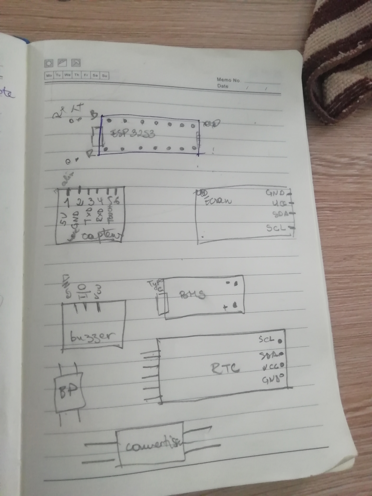
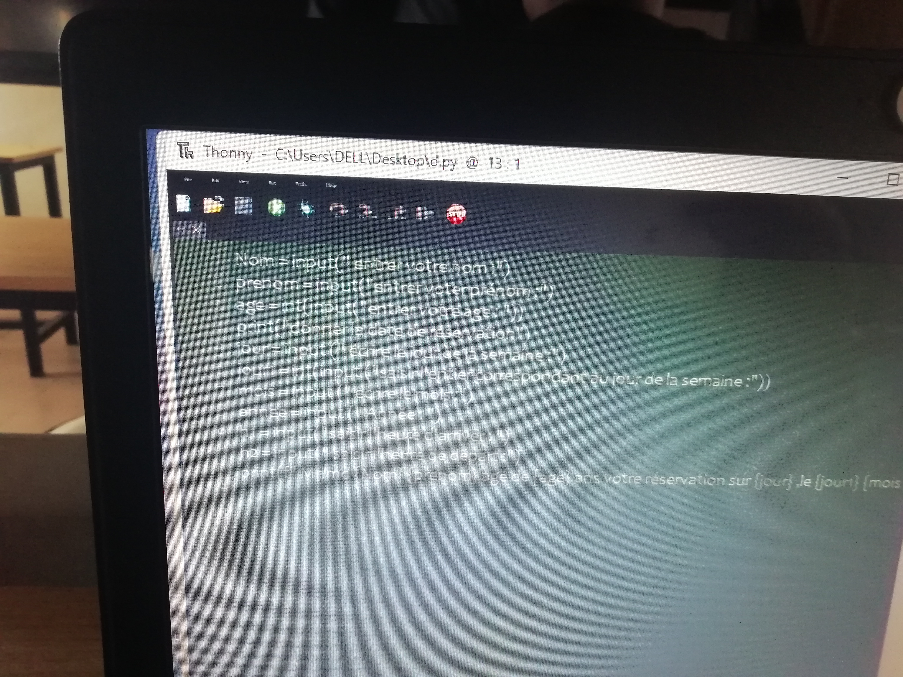

## Journal - jeudi 03 septembre 2026(rédigé par Marc HODIA)

## Fait aujourd'hui
- Les bases de la programation en python
- Ecrire un code de réservation pour entrer dans un fablab
- Etude des composants pour notre projet

## Appris 

- les bases de la programation en python
- maitrises des bornes de chaque composants

## Raté puis corrigé
- J'ai mis <nnn> et dans print j'ai mis <nn>.

## Décidé 
 - de bien suivre les commandes

 ## A faire demain
 - programation en Python(suite)
 
