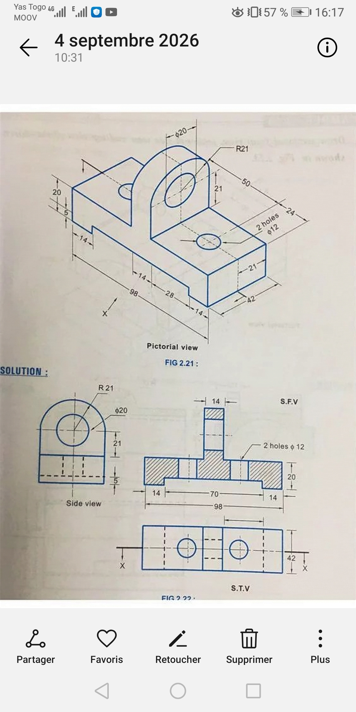

## Journal-vendredi 04 septembre 2026 (rédigé par Marc HODIA)

## fait aujourd'hui 
 - la suite de la programmation en python 
 - la fabrication de PCB à l'aide d'une plaque cuivrique en utilisant xtool F2 ULTRA pour tracer le branchement (le cablage) des composants .
 - Exercice d'application dans fusion 360

 ## Appris

 - la création une liste en python ( c= ["a" , " b" ])  
 - les opérations ( // =division entière ; ** = puisance  et autre )
 - la condition ( if condition : à la ligne espace ; elif ;else ) 
- les boucles (for i range [ 1:9] :; while condition : )
- tuple ("a", "b" ):liste non modifiable puis dict{}
- bouleen (true/false)
- la fabrication de PCB plaque de cablage:les reglages sur xtool f2 ultra depend du l'épaisseur de la plaque de cuivre rouge.
- pour une plaque de 0,3mm d'épaisseur il faut modifier: la puissance =100 nomdre de passe =15 ;fréquence=30 vitesse= 800 defocalisation cochet .
- lancer le processus->pret

- Conception d'une pièce mécanique 

## Raté puis corrigé 
 - la conception de la pièce 

 ## Décidé 

 - de refaire l'exercice à plusieur reprise

 ## A faire demain 

 - station du météo.