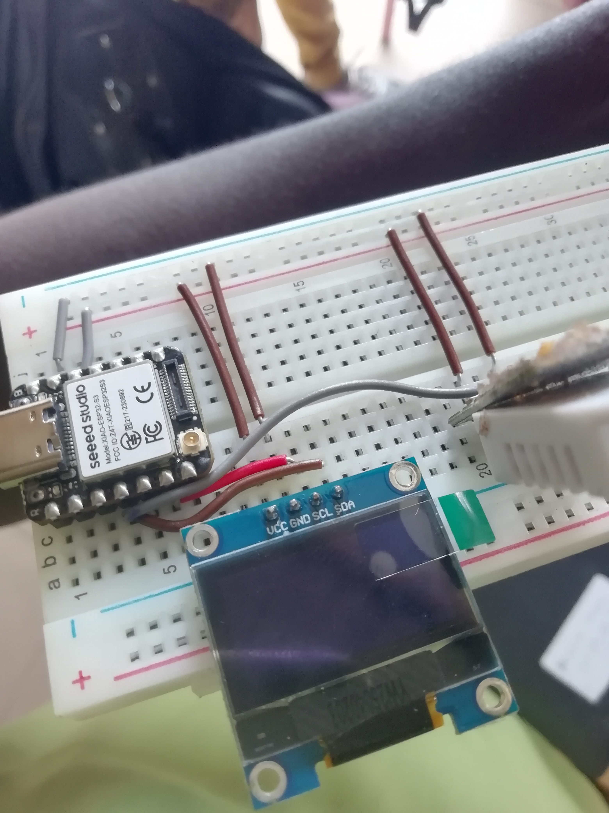
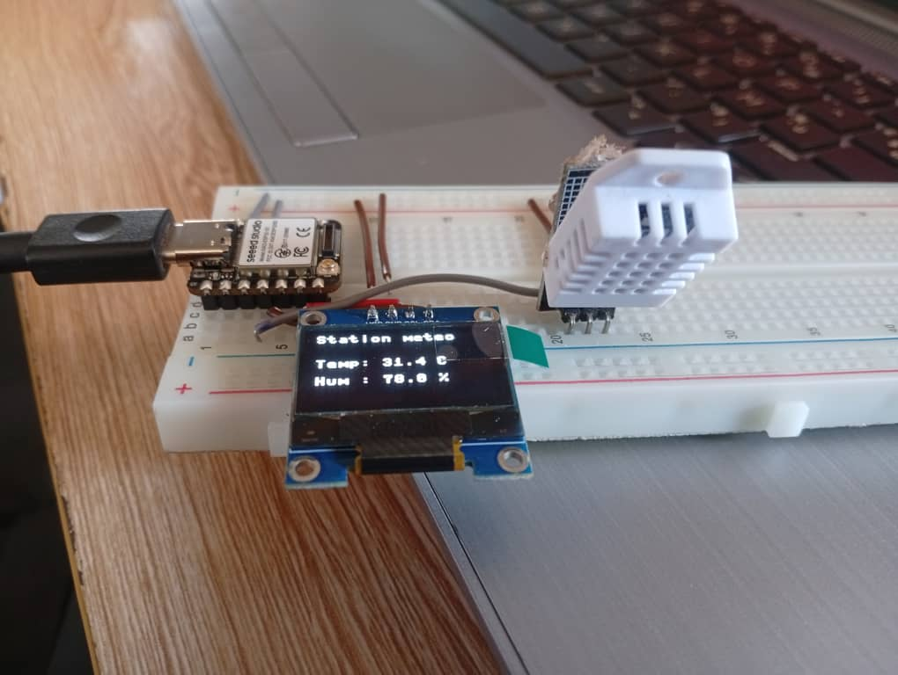

## Journal-samedi 05 septembre 2026(rédigé par Marc HODIA)

## Fait aujourd'hui 

- La fabrication d'une station météo avec les élément suivants: capteur d'humidité et de la température; xiao esp32 s3 ; écran d'affichage ; les fils de connection et breadboard.
- présentation du code micropython à copier sur esp32s3 ( ecrit en python ) 

## Appris

- le branchement entre les composants et entre l'ordinateur et l'ESP32 S3 du type C pour envoyer le code sur esp32  il faut flacher l'esp32 (tools-option-interprète puis choisie le nouveau élément qui s'ajoute dans la liste).
- L'éxécution du programme.

- votre station météo est là:

