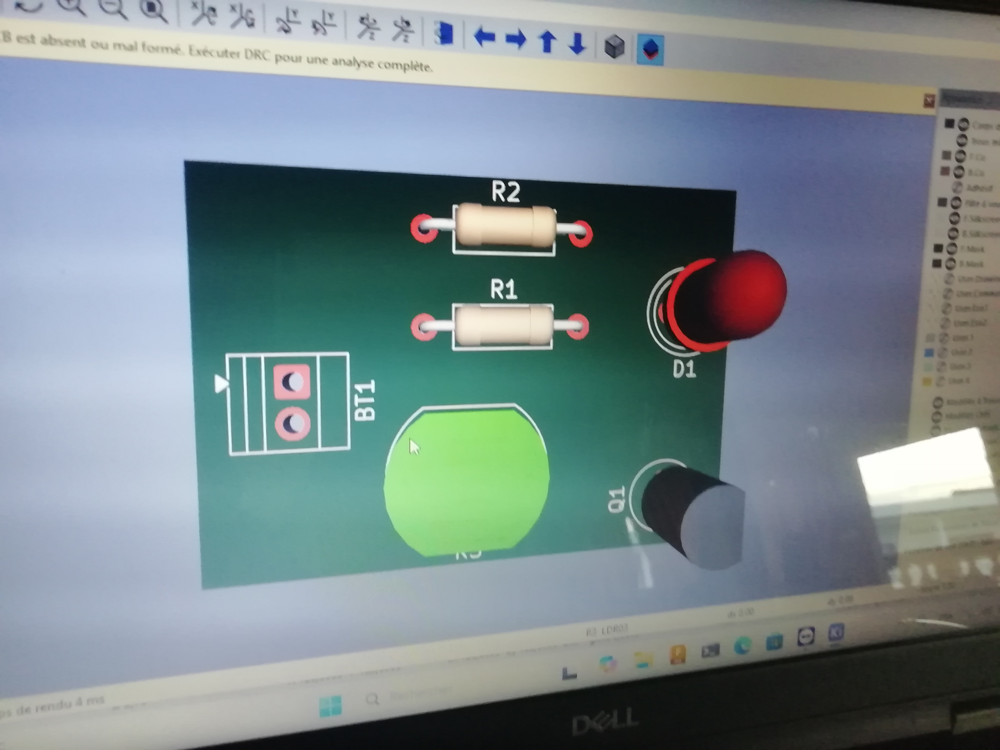
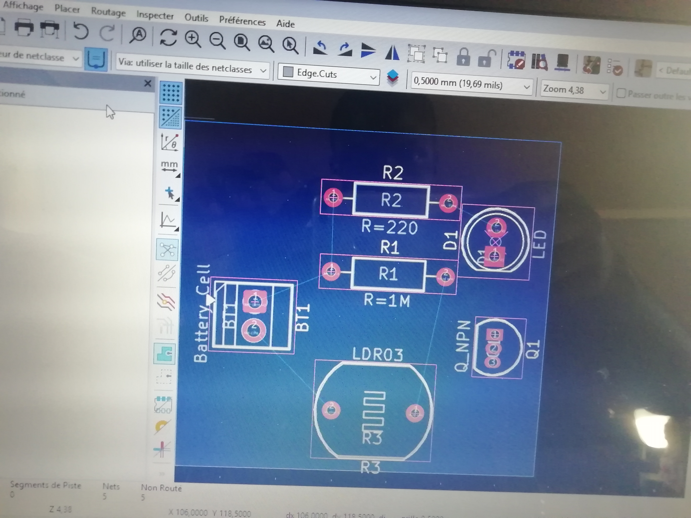

## Journal-Lundi 07 septembre 2026(rédigé par Marc HODIA)

## Fait aujourd'hui 

- Cours d'initiation aux PCB exposer par Mr KPADENU Arnaud.
- installation du logiciel kicard d'ou le travail a été éfectuer.

## Appris 

- Installation et ouverture de la  fenêtre du travail .
- importation des éléments du circuit électrique: LCD ,LED , résistances(2) , transistor , battery.
- le branchement entre les composants 
- la vérication des erreurs .
- exporter le circuit sur le PCB

## Raté puis corrigé
- le paramètrage du transistor( les autres éléments etais reliés entre eux sans le transistor).

## Décidé
-Bien faire le choix des composantts 
- fabrique le PCB pour educontrôle

## A faire demain 
- travail sur les projets 
