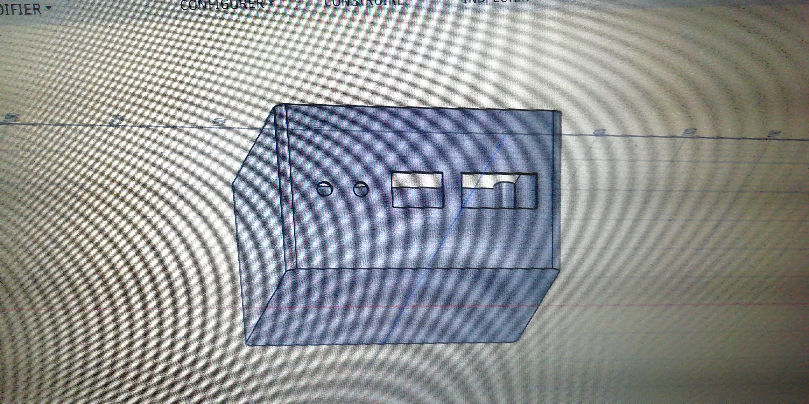
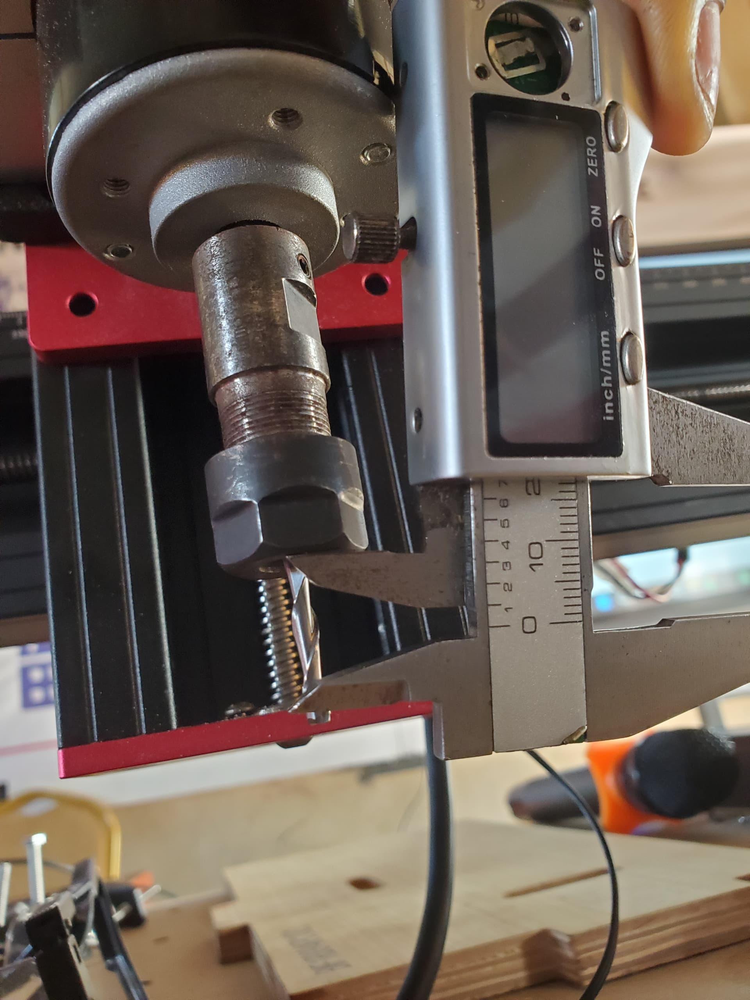

## Journal-Mardi 08 septembre 2026(rédigé par Marc HODIA)

## fait aujourd'hui 
- De la conception à la pièce avec la fusion 360 ( CAO -FAO- CNC )
- Bien definir les axes;orientation; type à utiliser;vitesse de coupe; vitesse d'avance; profondeur de passe; engagement radial;toujour vérifier la simullation avant d'usiner.
-Utiliser le pieds à coulisse pour effectuer les mesures 
- télécharger le post-processeur( grbl.cps)
- le projet: educontrôle; modelisation du boitier  la documentation du groupe ;la simullation de pcb ; conception du site web .

## Appris
- la CNC:commande numérique par caculateur;elle déplace un outil selon desaxes motorisés en suivant précisement le programme généré  la FAO
- elle joue le rôle de fraisage tournage  decoupe / routage
- toujours simuler avant l'usinage réel
- Adapter les paramètre au matériau età l'outil
- sécuriserle brut et l'origine pièces 
- vérifier  le post-proceseur utilisé 
- 

## Raté puis corrigé
- j'ai pas pu finir le paramètrage pour l' usinage 

## décidé  

- démander d'autre collège si possible l' encadreur

## A faire demain 
 - cours + projet 