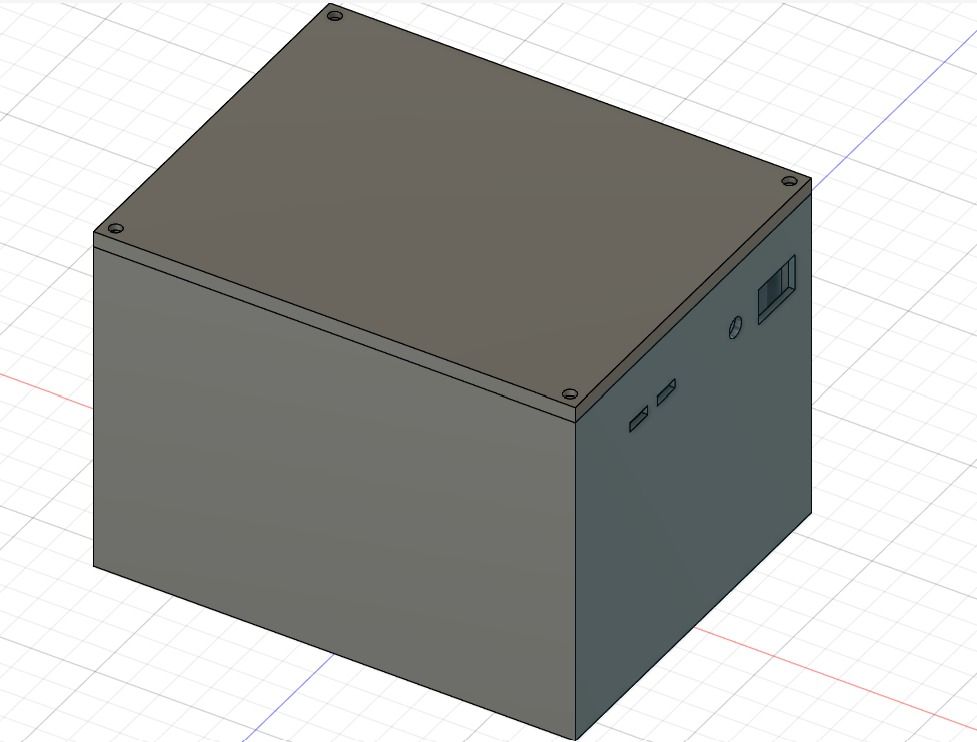

## Journal-vendredi 28 août 2026(rédigé par Marc HODIA)

## fait aujourd'hui 
- Nous avons  travaillé sur nos différents projet 
- conception du boitier avec fusion 360
- la conception du circuit de PCB à l'aide du kicad
- la configuration du site web avec vs-code.
## Appris
l' image du circuit sur le pcb

- le boitier 

- le site web 

## Raté puis corrigé
création des symboles 
- le perçage pour les vis .

## décidé  
- les recherches continues
## A faire demain 
- projet contitnue